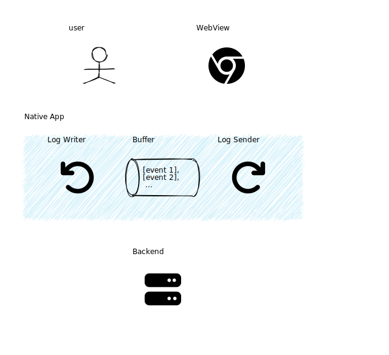

# Furumai

A tool of behavior visualization, via a DOT (Graphviz) like description:
<a href="https://raiich.github.io/furumai/">Furumai | behavior visualization tool</a>

Translations:

- [日本語](README.ja.md)

# Gallery

<p align="right"><a href="https://raiich.github.io/furumai/#/v1/LQhQCcHsFcHMAsBcACALuaBTUBnVBPAG0xQB9RlkA6WKaABwBpqAvSAO02QG9lCBDAEaZCKAORjkAXwrIAxO36oAlgDcuvAGbLCo+QBMADJuP9psqsvadwwTPtgbkeKAGtMwffxzx+4cPz4KAAsyADMANzO6JDuKLSBUTIgwKCgtDD0yADqmIIAasqYAO48stA4mOAA2j789JgAvA3gOBwAuhGyAMbwUAC2mNXK3RyNYoIB7Po4APS9A5hizALChOO5BUXFYp2gUl3pdFmKKupllKsi4wBySmpcAIL09GJdlAAykLDZ4MqoVWGo3Y42g00gyz4QmuYi+sByfwB4F272Qgmgmk0gKha3GACEMVjkcw6g1msoGsxUONKNVMOp2KhkABGdqMAA67DpDKZACY2ZzKFRhZI9p9vgBlTDTQEjMZicD2CEraHrWHfZBSmXIvYHNIZBho-jddzTC7OKrqGpykFiSrgK2Qq5qvHG036FH7Q4VKrIYAAPmQC0gg2q1LEAGFCCNXJ7g4M-YG4b9-oDwwAFaCCaM+T3JxG+gNowmA7oCHA4RpWGx2ByYPbozGFpOS6X6UvlyvVqq1xx7OFa9vgRNGk1tsPjQcooA">Edit</a></p>


---

<p align="right"><a href="https://raiich.github.io/furumai/#/v1/LQhQGcBcE8BsFMBcACAPqZyDEAnA9npMgN7IBuAluBQEYWwUwoAWFAJm-AHbIC+GyAHRc8nEsgBm9WCiwA2AAwBRAGIARAEIBuZFHwBrJMhFd4O-pmGj4gyPAAeRUlNgzsclQA4AnAEEATHwCgvBsAObw4np4hrIAwgDMcQCsXkEgwKCgYfgArgAOyLAAhtDwOACMJAI0FVo1-vW89dl5hSVlOIHEAsV1vY29CfWYxQAsTS0ZoLUA2pAAvADkkMw48ODMeLBs4AuzFQoAuksANEXFNPCwy-iES0f1ffPLZPuep94nj6DFCS9LN6zL4PJ5jAFAw7fFq1ZDAAB8yD69VhCKRE1+VTR41mbGgC38Cny9h+fzhiPGUzArDEfXJ6JhFQBq3Wm22bH23lOULOFyuNyWd0goJm-mZaw2Wx2nO5xxFz0WgPe0KydOxwxmWIpGpogXVKL1FImQA">Edit</a></p>


---


# Features

- Text-based description
    - You can write behavior in DOT (Graphviz) style
        - You can generate SVG images using DSL specialized for describing systems and algorithms.
    - Instead of a single picture, it will generate a motion diagram (a flipbook comic) from a text description
- Output to SVG
    - You can also adjust the appearance by specifying the SVG attribute.
- Layout engine that can specify placement in `Flexbox model` like CSS.

# Background

The existing drawing tools had the following difficulties.

- GUI drawing tool
    - You can arrange elements in any position, but it is hard to adjust if there are a number of elements
    - When there are many figures, you must also modify the related figures

- Text-based drawing tool
    - It is difficult to specify the position of the elements
        - The position is tend to be changed after another element is added/deleted
    - There is no diff mode for describing changes, so the amount of description tends to be large
        - It is necessary to describe the whole statements for the number of figures

Therefore, I developed a tool that can automatically create an action diagram by adjusting each element.

# Functions

## Basic Shapes

You can specify `box` / `person` / `cylinder` / `pipe` as the basic shape.
Arrows (`->` or `--`) can be placed between elements.

<p align="right"><a href="https://raiich.github.io/furumai/#/v1/IYYwLg9gTgjA2gZwBbAA4FMC8ByDUEQB22AugNwBQhEAJuvMmltgEYQAeplCkU9iKDDhABPADYBLQnShcKFULxgACALSrl1OjEpb6agHzKe0emSA">Edit</a></p>

```
actor1[shape='person'];
node1[shape='box'];
store1[shape='cylinder'];

actor1 -- node1;
node1 -> store1;
```


## Icon Shapes

You can specify Font Awesome icon as below.

<p align="right"><a href="https://raiich.github.io/furumai/#/v1/IYbQlgxg9gdgvAcgK4GcCmAnBBdA3AKACNxp4EM0BzJAG2AwHpVMcCITZFCNgYATFA0pgALgAskhVkA">Edit</a></p>

```
a[icon='user'];
b[icon='regular/user'];
c[icon='brands/github'];
```


## Behavior motion diagram (like a flipbook comic)

Separate each frame of the motion diagram with `---`.

### Diff mode (default)

Default is `diff mode`.
The `diff mode` is useful especially for "incremental small changes" such as explaining how an algorithm works.

<p align="right"><a href="https://raiich.github.io/furumai/#/v1/IYbgUARuDG4LQLMABHAfMqYF0qjsQA">Edit</a></p>

```
a;
b;
c;
---
a -> b;
---
b -> c;
```


---


If you hide it initial layout, it can be made to appear only after changes have been made.

<p align="right"><a href="https://raiich.github.io/furumai/#/v1/G4SwziBGIDYgLgTwLwAsQBMMFMB2BuAKEIHMAnAewFcAHAAgEMyyHE6BvQuugYwEYi3HgCZBvAMwBteMgDkAOkWyANHTDxKAa2xzcFXNlkBdMTwAsRAL5EAtHcL8iI6XL7CA7Mdv2e4p2ZdZNwAOLyA">Edit</a></p>

```
visibility=hidden;

group array {
  c1;
  c2;
  c3[t='...', stroke='none'];
  c4;
};
---
c1;
c2[t='127'];
---
c3;
c4[t='128'];
```


---


### Snapshot mode

If each frame is independent, use the `snapshot` mode.

<p align="right"><a href="https://raiich.github.io/furumai/#/v1/LQhQFsHsBMFMC4AEBnAdgQwA7IBaQC6gjCijoDcoARpQMaXFmLAB8iNRYVzb9QA">Edit</a></p>

```
---
mode: snapshot
---

a;
b;
c;
---
a -> b;
---
b -> c;
```


---


## Label / Text

<p align="right"><a href="https://raiich.github.io/furumai/#/v1/HYewJgpgjA2gzgCwIYAcIF4DkAjEAPTAGgAIAXLAYxGFIhuIQgCcJMBdAbgCgkLSQmsRKgyY0TONSLEANkmwQZWJMQCucZu25x+LIcjSUAnjICWwSE2lyFSzDoEQAhNPKYA1lABcxAG5QtIA">Edit</a></p>

```
node1[shape='box', t='content here'];
actor1[shape='person', label='a user'];
store1[shape='cylinder', label='store!', t='k1: v1'];
```


## SVG attribute

<p align="right"><a href="https://raiich.github.io/furumai/#/v1/HYRg2gLgvA5BCmAPCACEMA0KBmBLANvlAIYCOArsQLbEBOuw8AugNwBQwATOxyCgLQA+FFzBsUKAM4RaAewDW8fgHdcAEwgALKAHYM4qTIVL8DeAGNiAB1hzywNZgPS5i-muKTNdWsQCeUABEAMwoAJyBBrJWxOa4EAGBAAwAdACskRLQMMQoCMhOWUgQKXiEUADExABs2PqsQA">Edit</a></p>

```
n1[t='text 1', fill=aquamarine];
n2;

n1 -> n2[
  stroke-width=7,
  stroke-linecap='round',
  stroke-dasharray="3 9"
  opacity="0.5"
  t='a text',
  text.fill=#a6f,
];
```


## Zone / Group

There are the following methods to summarize the diagram elements.

- `group`
    - Lay it side by side
- `zone`
    - It arranges them in vertical direction

<p align="right"><a href="https://raiich.github.io/furumai/#/v1/OYJw9grgDgBAxgRhgbwFAxgMwJYBtcC8AxJpgKYDc6MAtmQNoDOAFgIZRkEDkHIjYAOy4BdKhgBG4AO6MyIBGJgAXMGFwLUAX1ShIsWSABu2OGSRoMOfAC4YJcooBegsjFaPz1S3kIkymRQwocAAPAE8NDAlWOABrMgEAE0iYbQxnAVd3ACYULywfYnIA-OCwcOzAmHEY+KTK6m1tVDoYAFoAPmrpAw0VNSRO7rAZOQR6UVRUSRHe9q6y8I0Z0fl5mEWwhs3Brpq4hOSqTdyh-brEyqA">Edit</a></p>

```
group c1 {
  fill=#ffe;
  me[shape='person'];
  browser1;
  tool1;
}
group service1 {
  fill: #ffe;
  zone az1 {
    fill=#fef;
    proxy1;
    backend1;
  }
  zone az2 {
    fill=#fef;
    proxy2;
    backend2;
  }
}

me -> browser1;
tool1 -> browser1[];

browser1 -> proxy1;
browser1 -> proxy2;
proxy1 -> backend1;
proxy2 -> backend2;
```


## Style

It can be styled just like CSS.
The name of the node, etc. is used as the `id`. You can also set `class` names.

The following IDs and classes are provided by default.

- `#root` : Top level element
- `.group`, `.zone` : groups, zones
- `.node`, `.edge` : nodes, edges
- `.text`, `.label` : texts, labels

<p align="right"><a href="https://raiich.github.io/furumai/#/v1/LQhQGcBcE8BsFMBcACAPqZyDEA7AjMgN7JQBOA9gNZLYBsAhgGbIC+G2+yAdLPQEbxYRZIwCWsWCiyMGAbhHkckYOFEAvGgGYATAAcAHvLaZcBLpHj7IwsRKn1ajWce4BjWOGAFitydkb09M6gIMCgoPgA2pAAvADkFlbIeHEANCLisDH0AI4ArvQAtvSkojjwALqyEdqR7vTg4DEARO6eeM1V4ZzAAHzIOLXsZFTwwADuogAmkAAWMQDsqcOQFNTAsGXwrvS68RR5OFNpK2tjUw2zJaT00C2ayACczezkuvSuojAtAAxcAKwvTCxOL0ZCJSAnYGWSBcXwxLAORjLKpAA">Edit</a></p>

```
---
style: |
  #n1 { stroke: #6af }
  #n1 .label { fill: #f6a; font-size: 32px; }
  #n1 .text { fill: #a6f;}
  .cls-1 { fill: #faa;}
---

n1[t='text 1', fill=aquamarine];
n2[class="cls-1"];

n1 -> n2[
  stroke-width=7,
  stroke-linecap='round',
  stroke-dasharray="3 9"
  opacity="0.5"
  t='a text',
  text.fill=#a6f,
];
```


## Margin / Padding

You can set `margin` / `padding`, like web pages.

<p align="right"><a href="https://raiich.github.io/furumai/#/v1/HYRg2gtghgTg5gS2AXgOQDYAMAHAHqgGgAIAXNEgU1xIEJCjsoATJpOZEdPAXQG4AoYACZIsRClRC89MqkrUadYoxZs0IHLiJCAHNL6ChI6PCTIAzJr5A">Edit</a></p>

```
n1[margin='60px', t='text!', padding=16px];
n2[margin='2px', t='text!!', padding='10px 28px'];
n22[margin=30px];
```


## dx / dy

There are cases where arrows overlap as a result of automatic placement.
You can shift the arrangement of arrows by specifying the `dx` / `dy` attribute.

<p align="right"><a href="https://raiich.github.io/furumai/#/v1/IYbgUARuDG5g5gJwPYFcAOACeAmTBvMTTAE3GIFNzMAzcAXzmEwFoA+TaAbRIA8BeAMwAGdLwC64CKw6wwJGbXAVFNHgE9+OYZKA">Edit</a></p>

```
a;
b;
c;

group g2 {
  d;
  e;
  f;
};

a -> c[dx=30px];
b -> c;
d -> f;
e -> f[dy=20];
```


## Layout like CSS Flexbox

<p align="right"><a href="https://raiich.github.io/furumai/#/v1/LQhQGcBcE8BsFMBcACAPqZyDEBzATMgN4abIBWArlAJYBm0wAxgPYB2k87KUAhgE6QA3CQC+JXAGYiJTJRr0mbDl2TgADj0bxg-ZhVYATYZjEhgoUDj561yHAEYiyHoOQAjV2Ks27BQskZPS2sKWxwpfyNkLxCwgBYneE8gA">Edit</a></p>

```
---
style: |
  #g2 {
    justify-content: start;
  }
  #g3 {
    justify-content: space-around;
  }
---

group g1 { a; b; }
group g2 { c; }
group g3 { d; }
group g4 { e; }
```


## Direction / Orientation

You can change the layout direction by specifying `flex-direction` in `style` or `orientation` in `config`.

<p align="right"><a href="https://raiich.github.io/furumai/#/v1/LQhQGcBcE8BsFMBcACAPqZyDEAnA9npMgN4abIBmCAHsACYCWO8AxpA3gHYr4DuA3GQC+oEMFCgAhv2QAjGS35A">Edit</a></p>

```
---
style: |
  #root {
    flex-direction: row;
  }
---

a; b; c;
```


<p align="right"><a href="https://raiich.github.io/furumai/#/v1/LQhQBMEsCcFMGMAukD2A7AXAAgDYEM1wBnePAB1lBGFFDRXFgEYBuUPJFaJgbSIAtysALwVoRdAF02RRF2Z9BFYfACeOSIVjRpQA">Edit</a></p>

```
---
direction: landscape
---

node1;
actor1[shape=person];
store1[shape=cylinder];
```


## Hide displayed elements

To hide the displayed element, use `hide` as follows.

<p align="right"><a href="https://raiich.github.io/furumai/#/v1/LQhQFsHsBMFMC4AEBnAdgQwA7IBaQC6gjCijoDcoARpeosAHyI2nGg4CWcidjzlRMJ240gA">Edit</a></p>

```
---
mode: snapshot
---

a;
b;
a -> b;

---
hide a -> b;

---
hide b;
```


---


## Comment

`//` is line comment.

## Rough Mode

<p align="right"><a href="https://raiich.github.io/furumai/#/v1/LQhQCcHsFcHMAsBcACALuaBTUJigIYDcQA">Edit</a></p>

```
---
rough: true
---
a;
```


# Syntax

[Furumai.g4](Furumai.g4)

<Footer></Footer>
